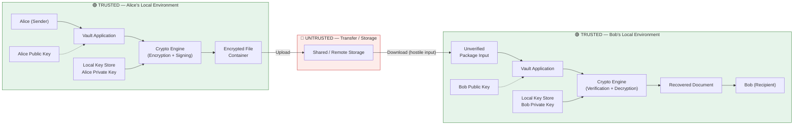

Repository for Cryptography Coursework 2027-1

# Cryptography Coursework 2027-1 — Team 6

Repository for Cryptography Coursework 2027-1 (Group 4, Team 6).

**Team Members**
- Esteban Arellanes Conde
- María Fernanda Cervantes Valencia
- Axel Gael Méndez Galicia
- Cristian Rea Alberto 

**Professor:** Dra. Rocío Alejandra Aldeco Pérez
**Project:** Secure Digital Document Vault

---

# D1 — Architecture & Threat Model

```
README.md
│
├── System Overview
│   ├── Problem Statement
│   ├── Core Features
│   └── Explicitly Out of Scope
│
├── Architecture
│   ├── Trust Model
│   ├── Architecture Diagram
│   └── Cryptographic Operation Placement
│
├── Security Requirements
│
├── Threat Model
│   ├── Assets
│   ├── Adversaries
│   └── Attacker Capabilities & Limitations
│
├── Trust Assumptions
│
├── Attack Surface Review
│
├── Logical Security Mapping
│   (Asset → Threat → Attack Scenario → Security Requirement → Design Constraint)
│
├── Architectural Security Decisions
│
└── Defined Tools To Use
    ├── Programming Language
    ├── Cryptographic Library
    ├── Hash Functions
    ├── KDF
    ├── Symmetric Cryptography
    ├── Asymmetric Cryptography
    ├── API Framework
    └── Randomness Requirements
```

---

## 1. System Overview

### 1.1 What problem does your vault solve?

The Secure Digital Document Vault lets two people exchange sensitive files — Alice sends a document, Bob receives it — without needing to trust the channel or storage in between. Alice's document could travel through a shared cloud folder, a USB drive, or any network path; the vault assumes that space is public and hostile.

The core problem is simple to state: an attacker who gets hold of the stored or transmitted package must not be able to read the document, tamper with it undetected, or impersonate Alice. To solve this, the vault keeps every cryptographic operation — encryption, signing, key storage — inside the sender's and recipient's own trusted local environment. Only the finished, protected package ever leaves that environment. Nothing sensitive (plaintext, private keys) is ever exposed to the untrusted storage or transport layer.

### 1.2 What are the core features?

1. **Document import** — load a local file into the vault for protection.
2. **Secure package creation** — encrypt and sign the document before it leaves the trusted environment.
3. **Recipient binding** — cryptographically tie the package to the intended recipient so it can't be silently redirected.
4. **Sender authentication** — let the recipient verify who actually created the package.
5. **Integrity protection** — make any tampering with the package detectable.
6. **Secure storage** — store or transfer the protected package through infrastructure that is treated as untrusted by design.
7. **Package validation** — check structure, authenticity, and integrity of every incoming package before touching it further.
8. **Authorized recovery** — only the intended, verified recipient can decrypt and read the document.
9. **Key management** — keep private keys inside a local, trusted key store, separate from the shared package.
10. **Fail-closed verification** — if any check fails (signature, integrity, authorization), the system rejects the package instead of releasing the plaintext.

### 1.3 What is explicitly out of scope?

- Protecting a device whose OS or application environment is already fully compromised.
- Recovering a lost private key or a forgotten password.
- Guaranteeing availability if an attacker deletes or blocks access to a stored package.
- Protecting the document after the user intentionally exports it out of the vault.
- Building a full production PKI or certificate authority.
- Defending against a legitimate user who deliberately shares their own decrypted document or private key.
- Physical protection of the device itself.
- Finalizing the exact cryptographic algorithms — that belongs to the implementation phase, not this architecture deliverable.
- Guaranteeing resistance against future, not-yet-discovered cryptanalytic attacks.

---

## 2. Architecture

### 2.1 Trust Model

The system has two trust zones:

- **Trusted local environment:** the user's device, the Vault application, the local key-management component, and the cryptographic library.
- **Untrusted environment:** shared or remote storage, packages in transit, unverified metadata, and any externally supplied input.

The two trust boundaries are crossed when a protected package **leaves** the sender's trusted environment, and when a retrieved package **enters** the recipient's trusted environment.

### 2.2 Architecture Diagram



**Legend**
- 🟢 Green zones = trusted (application logic, crypto engine, private keys).
- 🔴 Red zone = untrusted (anything an attacker may read, copy, modify, replace, replay, or delete).
- Solid arrows = data flow. Dashed arrows = key material used for verification/encryption, not transmitted.

### 2.3 Cryptographic Operation Placement

| Operation | Where it happens |
|---|---|
| Encryption | Inside the sender's trusted local environment, before the package touches external storage |
| Signing | Inside the sender's trusted local environment |
| Signature verification | Inside the recipient's trusted environment, **before** the package is accepted |
| Decryption | Inside the recipient's trusted environment, **after** validation and authorization succeed |
| Private keys | Never leave their corresponding local key store |
| Public keys | May be distributed externally, but their authenticity must be established before they are trusted |

The exact algorithms are intentionally not fixed at the architecture stage — see [Defined Tools To Use](#8-defined-tools-to-use) for the implementation direction already selected by the team.

---

## 3. Security Requirements

| ID | Requirement | Protected asset / threat |
|---|---|---|
| SR-01 | An attacker who obtains the protected container must not learn the plaintext document contents without the secret key material required by an intended recipient. | File contents / disclosure |
| SR-02 | Any unauthorized modification to the protected document must be detectable before it is accepted as authentic or released as plaintext. | File contents / tampering |
| SR-03 | A recipient must be able to determine whether a protected package was produced by the claimed sender, given authentic sender public-key information. | Sender identity / spoofing |
| SR-04 | Private cryptographic keys must never be disclosed to remote storage, other recipients, or untrusted package contents. | Private keys / key theft |
| SR-05 | Security-relevant metadata (recipient identity, sender identity, version, processing parameters) must be protected against unauthorized modification. | Metadata / substitution |
| SR-06 | A retrieved package must be treated as untrusted input until its structure, metadata, authenticity, integrity, and authorization have been validated. | Package / malicious input |
| SR-07 | The system must maintain a clear separation between public and private key material. | Private keys / compromise |
| SR-08 | An attacker who modifies, replaces, truncates, or reorders security-relevant data must not cause the package to be accepted without detection. | Container / tampering |
| SR-09 | Only a recipient possessing the required secret key material may recover the document intended for that recipient. | File contents / unauthorized access |
| SR-10 | If validation, authentication, integrity, authorization, or decryption fails, the system must fail **closed** and never release the resulting plaintext as trusted. | Plaintext / fail-open behavior |

---

## 4. Threat Model

### 4.1 Assets

| Asset | Description | Security properties |
|---|---|---|
| A1 — File contents | Confidential documents handled by the vault | Confidentiality, integrity |
| A2 — File metadata | Names, sender/recipient identifiers, package info | Integrity, confidentiality (where applicable) |
| A3 — Private keys | Sender's and recipient's secret cryptographic material | Confidentiality, integrity |
| A4 — Passwords / secrets | User secrets used to unlock local key material | Confidentiality |
| A5 — Public-key identity info | Public keys associated with users | Authenticity, integrity |
| A6 — Signature validity | Evidence connecting a package to its claimed sender | Authenticity, integrity |
| A7 — Secure container | The serialized, protected package | Confidentiality, integrity, authenticity |
| A8 — Access-control decisions | Whether a package may be opened | Integrity |

### 4.2 Adversaries

- **External storage attacker** — can copy, read, replace, modify, delete, replay, and submit malformed packages. Cannot read trusted local memory or break the assumed cryptographic primitives.
- **Malicious package modifier** — can alter ciphertext/metadata, replace identities, truncate/reorder fields. Cannot forge valid authentication evidence without the secret signing key.
- **Temporary device-access attacker** — may try to access local files or exposed interfaces, but is not assumed to fully compromise the OS.
- **Malicious or unintended recipient** — can inspect packages they possess and try identity/key substitution, but cannot recover content meant for a different recipient without that recipient's key.

### 4.3 Attacker Capabilities and Limitations

The baseline model is a **Dolev–Yao-style hostile storage/transfer model**: the attacker may observe, copy, modify, replace, replay, and delete transferred data.

The attacker is **not** assumed to be able to: break the underlying cryptographic primitives, directly compromise the trusted OS, extract secrets from a correctly functioning key store without a local compromise, or alter the trusted Vault application after deployment.

Availability is explicitly **not** a guaranteed property here — an attacker who deletes the only stored copy of a package can prevent access even while confidentiality and integrity remain intact.

---

## 5. Trust Assumptions

1. The Vault application executes the intended security logic and has not been tampered with.
2. The selected cryptographic library correctly implements its primitives.
3. The local OS provides sufficiently secure randomness and basic process isolation.
4. Users protect their passwords and local key-unlocking secrets.
5. Users do not intentionally disclose their private keys.
6. Public keys used for identity decisions are obtained through a trusted mechanism or validated before use.
7. Remote/shared storage is considered fully untrusted.
8. Every retrieved package is treated as attacker-controlled input until validation succeeds.
9. The selected cryptographic primitives retain their intended security properties over the life of the system.
10. Legitimate key holders are trusted to control access to their own plaintext.
11. Protection outside the Vault's controlled plaintext boundary (e.g., after export) is not guaranteed.

---

## 6. Attack Surface Review

| Attack Surface | What could go wrong? | Property at risk | Response |
|---|---|---|---|
| File input | Malicious file, unexpected size/type, path traversal, resource exhaustion | Integrity, availability | Validate input; never trust file names/paths |
| Package parser | Malformed lengths, invalid/duplicate fields, parser confusion | Integrity, availability | Strict schema validation before crypto processing |
| Metadata | Recipient/sender identifiers modified by attacker | Authenticity, confidentiality | Cryptographically bind security-relevant metadata |
| Encrypted container | Ciphertext modified, truncated, reordered, or replaced | Integrity, authenticity | Detect modification before plaintext is ever accepted |
| Public-key import | Attacker substitutes a public key | Authenticity, confidentiality | Require trusted key association/verification |
| Private-key import/export | Key copied, replaced, or exposed | Confidentiality, authenticity | Isolate private keys; protect key-management operations |
| Password entry | Credential exposure or insecure local handling | Key confidentiality | Never log secrets; minimize exposure |
| Sharing workflow | Package sent to wrong recipient, identity substituted | Confidentiality, authenticity | Bind recipient identity to the protected package |
| Signature verification | Wrong key selected, verification bypassed | Authenticity, integrity | Verify key identity before accepting a signature |
| Decryption workflow | Decryption attempted before validation, or failed validation ignored | Confidentiality, integrity | Validate first; fail closed |
| CLI/API arguments | Malicious paths, identifiers, options, oversized input | Integrity, availability | Strict argument validation, bounded resources |
| Storage interface | Replay, replacement, deletion, stale package retrieval | Integrity, availability | Include package identity/version/freshness info |
| Error handling / logging | Secrets or plaintext leaked into logs/errors | Confidentiality | Never log passwords, private keys, plaintext, or key material |

---

## 7. Logical Security Mapping

**Asset → Threat → Attack Scenario → Security Requirement → Design Constraint**

| Asset | Threat | Attack Scenario | Security Requirement | Design Constraint |
|---|---|---|---|---|
| File contents | Disclosure | Attacker obtains a stored package and attempts recovery | SR-01 | Plaintext must never enter untrusted storage |
| File contents | Tampering | Attacker modifies protected bytes before retrieval | SR-02 | Verify integrity/authentication before trusting plaintext |
| Sender identity | Spoofing | Attacker creates a package claiming to be Alice | SR-03 | Package must contain verifiable sender-authentication evidence |
| Private keys | Disclosure | Attacker searches shared storage for decryption/signing secrets | SR-04 | Private keys must never be stored in the shared package/storage |
| Recipient metadata | Tampering | Attacker changes Bob's identity to another recipient | SR-05 | Recipient identity must be cryptographically bound to the package |
| Package structure | Malicious input | Attacker supplies malformed lengths or fields | SR-06 | Strict package schema and bounded parsing |
| Secure container | Replacement / replay | Older valid package replaces a newer one | SR-08 | Include package identity/version/freshness information |
| Access-control decision | Authorization bypass | A valid package is processed with the wrong recipient/key | SR-09 | Check recipient binding and authorization before decryption |
| Plaintext output | Fail-open behavior | Validation fails but decrypted data is still exposed | SR-10 | All security checks must gate plaintext release |

### 7.1 Architectural Security Decisions

- **AD-01** — Encrypt before external storage: the sender's Vault protects the document before it crosses the trust boundary.
- **AD-02** — Keep private keys local, inside the trusted key-management boundary.
- **AD-03** — Authenticate the sender: the package must carry evidence the recipient can verify.
- **AD-04** — Bind metadata: security-relevant metadata cannot be edited independently without detection.
- **AD-05** — Treat every retrieved package as hostile input.
- **AD-06** — Verify before plaintext: structural, authenticity, integrity, and authorization checks precede any plaintext release.
- **AD-07** — Separate public/private key handling: public keys may be distributed, private keys stay local.
- **AD-08** — Fail closed: security failures result in rejection, never partial acceptance.

---

## 8. Defined Tools To Use

The implementation will rely on established, well-reviewed cryptographic libraries rather than implementing primitives from scratch.

| Component | Choice | Notes |
|---|---|---|
| Programming Language | Python 3.10+ | Mature ecosystem, native byte/bitwise handling, no manual memory management overhead |
| Cryptographic Library | PyCA `cryptography` (hazmat layer) | Industry-standard, audited primitives |
| Hash Functions | SHA-256, SHA-512 | Integrity verification, digital signatures, digests |
| KDF | PBKDF2-HMAC-SHA256 or HKDF | Deriving keys from passwords / existing key material |
| Symmetric Encryption | AES-256-GCM | Authenticated encryption — confidentiality + integrity in one primitive |
| Asymmetric Cryptography | RSA-2048/4096 or Ed25519 / SECP256R1 | Key exchange, digital signatures, entity authentication |
| API Framework | FastAPI | Structured endpoints, Pydantic validation, auto-generated OpenAPI docs |

### 8.1 Randomness Requirements

Cryptographic randomness is a security-critical part of the system. The project explicitly **prohibits**:

- UNIX/C `rand()` / `srand()`
- Python's non-cryptographic `random` module

for generating keys, salts, nonces, tokens, or any other security-sensitive value.

Security-sensitive randomness must instead come from a cryptographically secure source, such as Python's `secrets` module, `os.urandom()`, or the key-generation functions provided directly by the `cryptography` library.

```python
# ❌
import random
key = random.randint(0, 2**256)

# ✅
import os
key = os.urandom(32)  # 256-bit key from a CSPRNG
```

---

## 9. Relationship Between Documents in This Repository

- **This README** is the canonical, up-to-date architecture and threat model for the **Secure Digital Document Vault** — the project the team is actually delivering.
- The D1 deliverable is submitted as a **PDF** (`D1_Architecture_Threat_Model.pdf`), which mirrors the content of this README with full formatting and the rendered architecture diagram.
- Earlier drafts exploring a "SPEI-style payment network" alternative have been superseded and are not part of the final submission.

Random values required by the cryptographic design, such as salts, nonces, initialization values, or key material, must instead be generated using a cryptographically secure randomness mechanism provided by the selected cryptographic platform/library.

The random-number generation mechanism must therefore be treated as a security requirement and documented as part of the final cryptographic implementation.
